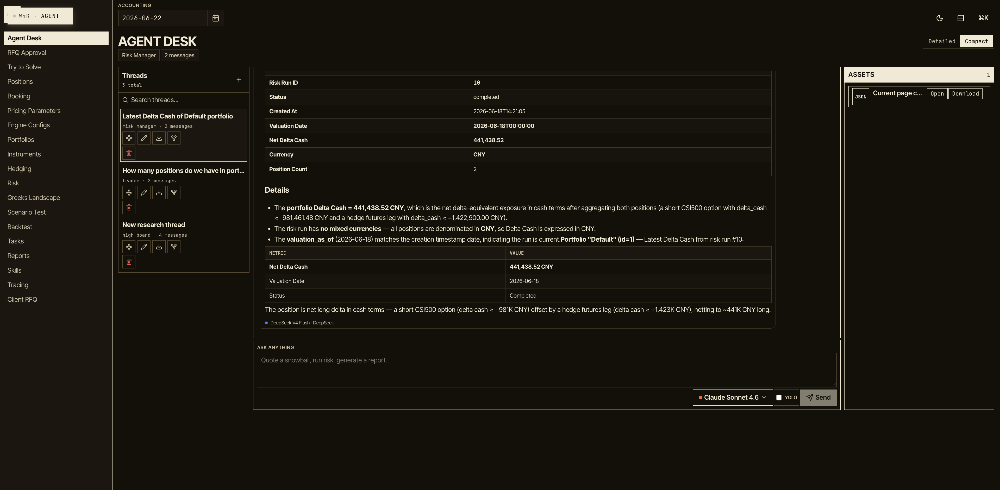
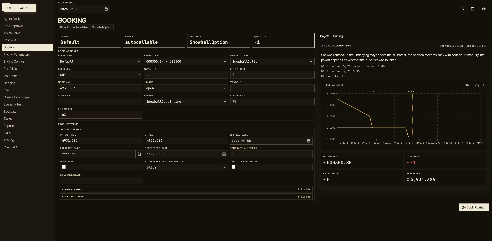
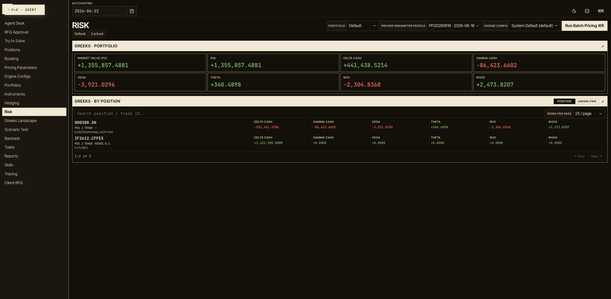
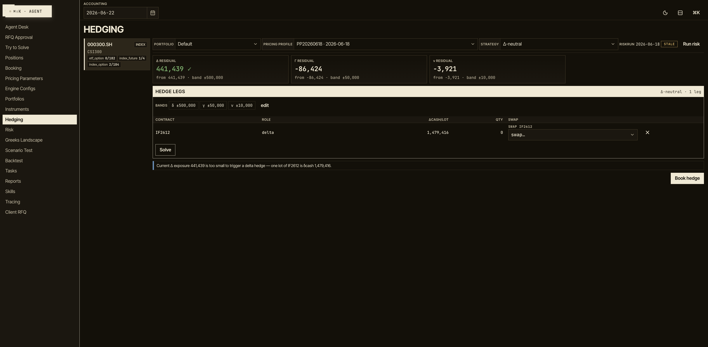
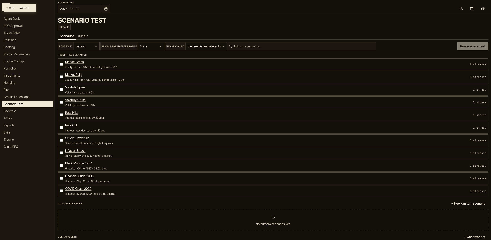
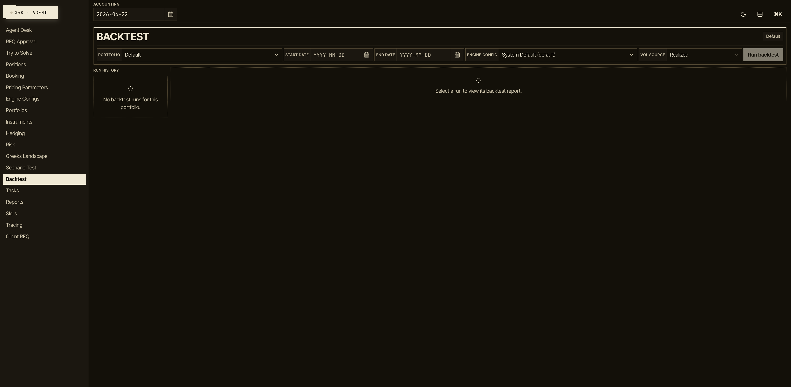
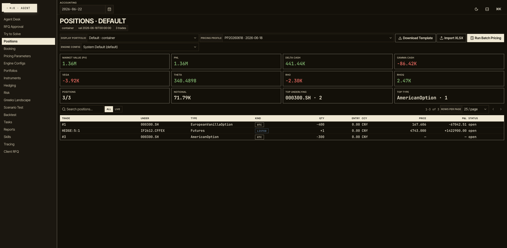

# Open OTC Trading

> **One assistant. Your whole desk.** — structured products, priced in real time.

[](LICENSE)
[](https://www.python.org/)
[](https://react.dev/)
[](docs/arena/)



---

## Overview

Open OTC Trading is an AI-native trading desk for structured equity derivatives. Talk to it the way you'd brief a junior trader — *"Quote a 12-month CSI 300 snowball, KO 103, KI 75, 8% coupon"* — and it pulls live spot, builds the product, and prices it with full Greeks. You approve; it books. From there the same assistant aggregates portfolio risk, solves and sizes hedges, runs stress tests and backtests, and writes the reports.

It pairs a **deterministic quant engine** ([QuantArk](https://github.com/deiiiiii93/quant-ark)) — so every price, Greek, and scenario is reproducible and audit-traced — with **LLM-powered agents** that handle the research and workflow around it. The numbers never come from a language model; the conversation does.

### The desk, end to end

The product walkthrough tells it as one continuous flow:

1. **Ask** — A trader describes a structured product (snowball, phoenix, autocall, sharkfin, Asian) in plain language, or a client submits an RFQ through the portal.
2. **Price** — The agent fetches market data, assembles the term sheet, and returns PV plus full Greeks (Δ, Γ, Vega, Theta) from QuantArk.
3. **Book** — Nothing is committed silently. The agent surfaces a **human-in-the-loop** confirmation card (`Approve` / `Reject`) before any position or hedge hits the book.
4. **Risk** — One pass aggregates portfolio Greeks — delta cash, gamma, vega — broken down by underlying.
5. **Hedge** — A solver proposes Δ-neutral legs (e.g. index futures), sizes them to a residual delta, and books them on approval.
6. **Operate** — The same assistant drives stress tests, batch pricing jobs, hedging backtests, and report generation across the whole position book.

### A look at the desk

| Build · Price · Book | Portfolio Risk |
|:---:|:---:|
| [](docs/screenshots/booking.png) | [](docs/screenshots/risk.png) |
| Price a structured product with full Greeks, then confirm before it books. | Aggregated Δ/Γ/Vega/Theta in one pass, sliced by underlying. |

| Hedging | Scenario / Stress Tests |
|:---:|:---:|
| [](docs/screenshots/hedging.png) | [](docs/screenshots/scenario.png) |
| A solver proposes and sizes Δ-neutral hedge legs. | Shock spot, vol, and rates across the book. |

| Backtesting | Position Book |
|:---:|:---:|
| [](docs/screenshots/backtest.png) | [](docs/screenshots/positions.png) |
| Replay hedging strategies over history. | Every booked position, live-valued. |

### Key Features

- **Conversational desk** — Brief an LLM agent in natural language; it calls deterministic tools for pricing, risk, hedging, and booking. Responses stream token-by-token with structured asset cards and charts.
- **Pricing engine** — Multi-engine Greeks (analytical, Monte Carlo, PDE) via QuantArk, across snowball, phoenix, autocall, sharkfin, Asian, digital, barrier, and vanilla families.
- **Human-in-the-loop booking** — Positions and hedges require explicit approval; the agent proposes, you commit.
- **Portfolio risk** — Aggregated Greeks, scenario analysis, and position monitoring in a single run, sliced by underlying.
- **Hedging** — A MILP solver that proposes and sizes Δ-neutral hedge strategies, with lifecycle backtesting.
- **RFQ workflow** — Client portal for quote requests with an internal approval pipeline.
- **Dynamic subagents (governed fan-out)** — A recurring desk workflow can fan out to one read-only agent per work item (e.g. a commentary per breached position) inside a sandboxed QuickJS `task()` loop, then reconcile the results deterministically. Fan-out is server-gated (only allowlisted seeded workflows can trigger it), the fanned-out agents are strictly read-only, and every item is guaranteed exactly one record — uncovered items surface as `failed` rather than silently dropping. Opt-in, off by default.
- **Instant-messaging desk (Feishu/Lark)** — Drive the full agent from IM with web-desk parity: streaming **markdown** replies, human-in-the-loop Approve/Reject **cards** for bookings, pickable reply-option cards, and linking-code enrollment. Runs as a dedicated single-worker gateway behind a `MessageConnector` abstraction (Feishu first), so the same orchestrator, data, and audit trail back both the web desk and chat.
- **Market data** — AKShare adapter with caching and fallback for A-share / HK markets.
- **Long-term memory** — A cross-session memory layer distills durable facts — desk preferences, per-book context, and corrections — from closed sessions and injects the relevant ones into later conversations. Facts are scoped (`user` / `book` / `domain` / `correction`), with a propose→approve gate for shared domain knowledge and a dedicated **Memory** console to review, pin, edit, and approve them.
- **Compaction-safe evidence** — Deterministic tool and database results are captured byte-for-byte in an immutable content-addressed ledger before conversation compaction. The agent can progressively reopen an exact artifact by id and JSON/Markdown selector (no semantic RAG); hedge approvals show and revalidate the source artifact plus valuation, risk-generation, capture, and expiry timestamps.
- **Audit trail** — An always-on, append-only log of every dangerous action an agent takes — bookings, writes, deletes, async dispatches, artifact writes — **including actions taken in headless YOLO mode**. Distinct from the full `/tracing` transcript viewer, the **Audit** console surfaces just the write-class actions with their outcome, human-in-the-loop approval chain, and redacted arguments.
- **Model maintenance** — A **Model Maintenance** console (`/model-maintenance`) to add, edit, and delete LLM channels and models — and pick the registry default — without hand-editing `config/agent_channels.yaml`. Edits go through a comment-preserving, validate-then-commit write that hot-reloads the agent live; only the `api_key_env` **name** is stored (never a secret), with a per-channel health badge. Gated by `OPEN_OTC_FEATURE_MODEL_WRITE_API` (default on).
- **Reproducible & audited** — Every pricing run, risk run, and agent trace is persisted; QuantArk keeps the math deterministic.

---

## 🏆 The OTC Desk Agent Arena

**Can an LLM run the desk on its own?** The [**Agent Arena**](docs/arena/) is a
controlled, repeated-trial benchmark that drives the *real* desk orchestrator
end-to-end — pull risk, price the book, find the hotspot, stress it, back-test the
hedge, write the governance report — with **no human in the loop**, then scores
whether the model actually did it. Unlike a frozen-prompt benchmark, it runs the
production agent and reads each model's work back out of the system's own trace log.
The flagship workflow is a 9-step / 39-point manifest with anti-ceiling checks —
numeric grounding against tool results, instruction-adherence arg checks, a
nonexistent-scenario trap, and report-synthesis coverage — scored with per-axis
subtotals (procedural / adherence / grounding / synthesis); infra-blank matches are
marked invalid and excluded from leaderboard means rather than scored 0.

For an easy public view of the leaderboards and reports, visit [Artena](https://www.artena.one/arena/).

**Run #20 (latest)** evaluated **16 frontier and near-frontier models over two trials
each** using the new **Model Ability Card** — separating objective capability,
efficiency (EFF), and consistency (CON) rather than collapsing everything into one
score:

| Rank | Model | OVR | CON | EFF | Obj |
|:---:|---|:---:|:---:|:---:|:---:|
| 🥇 | **GPT-5.6 Terra** | **86** | 92 | **76** | 89.8 |
| 🥈 | GLM 5.2 | 85 | **96** | 60 | **91** |
| 🥉 | DeepSeek V4 Pro | 84 | **96** | **82** | 84.6 |
| 🥉 | GPT-5.6 Luna | 84 | **96** | 55 | **91** |
| 5 | MiMo V2.5 Pro | 82 | 92 | 54 | 89.8 |
| 10 | Grok 4.5 | 73 | 50 | 4 | **91** |

**Raw capability is not deployability.** Grok 4.5 ties the highest objective
score (**91**) but ranks **10th overall** because it burns ~52 tool calls per run
and scores **EFF 4**. GPT-5.6 Terra wins the board with the best balance of
objective strength, efficiency, and consistency. DeepSeek V4 Pro is the
reliability exemplar: byte-identical across both trials (CON 96) with the highest
EFF in the field.

📖 **Read Run #20 in full** —
[Markdown](docs/arena/2026-07-13-run20-otc-desk-agent-arena.md) ·
[HTML](https://htmlpreview.github.io/?https://github.com/deiiiiii93/open-otc-trading/blob/main/docs/arena/2026-07-13-run20-otc-desk-agent-arena.html) ·
[PDF](docs/arena/2026-07-13-run20-otc-desk-agent-arena.pdf)
&nbsp;·&nbsp; Previous runs (**Run #9** flash tier, **Run #8** frontier tier) and all
reports live in [**`docs/arena/`**](docs/arena/).

> New runs and additional **long-workflow match designs** are in progress and will
> be published in the Arena as they're released.

---

## Architecture

```
┌──────────────────────────────┐   ┌──────────────────────────────┐
│  Frontend (React 19 / Vite)  │   │  IM gateway (Feishu / Lark)  │
│  Radix UI · Recharts         │   │  WebSocket · HITL cards      │
└───────────────┬──────────────┘   └───────────────┬──────────────┘
                │ REST + SSE                        │ MessageConnector
                └────────────────┬──────────────────┘
                                 ▼
┌─────────────────────────────────────────────────────┐
│  Backend (FastAPI / Uvicorn)                         │
│  LangGraph agents · SQLAlchemy · Alembic migrations  │
└───┬────────────────┬───────────────────┬────────────┘
    │                │                   │
    ▼                ▼                   ▼
 QuantArk        SQLite DB         LLM Providers
 (pricing)     (positions,        (ZenMux, DeepSeek)
               traces, RFQs)
```

---

## Quick Start

### Prerequisites

- Python 3.11+
- Node.js 18+
- (Optional) [QuantArk](https://github.com/deiiiiii93/quant-ark) local checkout for development

### Backend

```bash
git clone https://github.com/deiiiiii93/open-otc-trading.git
cd open-otc-trading

python -m venv .venv
source .venv/bin/activate
python -m pip install -e ".[dev]"
cp .env.example .env
cp config/agent_channels.example.yml config/agent_channels.yaml
mkdir -p data artifacts
.venv/bin/python -m alembic upgrade head

# Run tests
.venv/bin/python -m pytest

# Start dev server (port 8000)
uvicorn app.main:app --app-dir backend --reload --reload-dir backend --reload-dir config --port 8000
```

> **Note:** If developing against a local QuantArk checkout, install it first:
> `python -m pip install -e /path/to/quant-ark`

### Frontend

```bash
cd frontend
npm install
npm run dev
```

Open http://localhost:5173

### Instant-messaging gateway (Feishu)

The IM gateway runs as a **dedicated worker process — not the `--reload` dev server**.
The Feishu WebSocket client drives its own blocking event loop on a background
thread, which does not survive uvicorn hot-reloads (a reload wedges the worker).
Keep `GATEWAY_ENABLED_CONNECTORS` empty in `.env` so reloading servers stay inert,
and enable the connector via a launch-time override on a stable worker:

```bash
# Configure the Feishu app for "long connection" (WebSocket) event mode and put
# FEISHU_APP_ID / FEISHU_APP_SECRET in .env, then:
GATEWAY_ENABLED_CONNECTORS=feishu .venv/bin/uvicorn app.main:app --app-dir backend --port 8001
```

A single-row DB lease ensures only one worker drives Feishu; every other backend
stays in standby. Enroll a desk user by POSTing to `/api/gateway/linking-codes`
and sending the returned code to the bot in a Feishu DM. Health: `GET /api/gateway/health`.

### CLI

```bash
open-otc --help
```

### Compaction A/B proof

Agent-behaviour improvements must carry paired evidence, not only unit tests. The
offline compaction benchmark passes identical captured OTC traces through the installed
DeepAgents/LangChain default summarizer and the ledger-aware candidate, then grades both
with deterministic rules:

```bash
python scripts/compaction_ab_benchmark.py
```

The command needs no API key, database, or network access. It writes auditable JSON and
Markdown reports under `outputs/`, including package versions, generation time, exact
input hashes, every per-case result, aggregate metrics, tradeoffs, and predeclared pass
criteria. Each JSON artifact fingerprints Python/platform, `pyproject.toml`, `uv.lock`,
the complete installed-distribution list, and the core DeepAgents/LangChain/LangGraph
stack. Lock alignment is a pass criterion, so a drifted environment cannot produce a
passing report. The benchmark measures structural evidence/timestamp recovery, raw
evidence exposed to the summarizer, continuation correctness, retained context,
targeted-read bytes, and observed latency. The controlled lossy summarizer intentionally
removes remote-model variance; live-model answer quality is outside this cheap PR gate.

For paired live-model evidence, use the same runner with `--live`. This supplements
the structural gate with real summary and continuation calls while keeping the scorer
deterministic:

```bash
uv lock --check --quiet
uv sync --locked --extra dev
.venv/bin/python scripts/compaction_ab_benchmark.py \
  --live --channel deepseek --provider deepseek --model deepseek-v4-flash \
  --trials 3 --max-tokens 1600
```

The four-case, three-trial default run makes 48 read-only model requests: one summary
and one continuation call for each arm and trial. It alternates arm order, gives the
default its complete rendered history and the candidate exact targeted reads of the
proposal plus current positions, and stores every prompt, response, call timestamp,
provider error, token count, and grade in
`outputs/compaction_ab_live_<model>.json`. The traces are deterministic synthetic OTC
cases; the run never reads the live portfolio database or executes a booking.

---

## Configuration

```bash
cp .env.example .env
cp config/agent_channels.example.yml config/agent_channels.yaml
mkdir -p data artifacts
.venv/bin/python -m alembic upgrade head
```

| Variable | Description | Required |
|----------|-------------|----------|
| `OPEN_OTC_DATABASE_URL` | SQLite connection string | Yes (has default) |
| `ZENMUX_API_KEY` | ZenMux unified LLM gateway key | No |
| `DEEPSEEK_API_KEY` | DeepSeek API key | No |
| `LANGSMITH_API_KEY` | LangSmith observability | No |
| `OPEN_OTC_TRACING` | Tracing mode: `local` \| `langsmith` \| `both` \| `off` | No |
| `OPEN_OTC_MEMORY` | Long-term memory capture: `on` (default) \| `off` | No |
| `OPEN_OTC_MEMORY_RECONCILE_SINCE` | ISO-8601 cutoff — when first enabling memory on an existing DB, only extract sessions closed at/after this instant (avoids mass-extracting the historical backlog) | No |
| `OPEN_OTC_HEDGE_RISK_MAX_AGE_SECONDS` | Maximum age of risk evidence allowed for hedge sizing/booking (default `900`); historical valuations are rejected regardless | No |
| `GATEWAY_ENABLED_CONNECTORS` | Comma-separated IM connectors to run (e.g. `feishu`); empty = gateway off | No |
| `GATEWAY_AGENT_MODEL` | Model for IM-originated turns, `channel:provider:model` (e.g. `zenmux:openai:deepseek/deepseek-v4-flash`); unset = registry default | No |
| `GATEWAY_WEB_BASE_URL` | Base URL for card deep-links back to the web desk (e.g. `http://localhost:5173`) | No |
| `GATEWAY_DEFAULT_DESK_USER` | Desk actor identity recorded for IM-originated turns | No |
| `FEISHU_APP_ID` / `FEISHU_APP_SECRET` | Feishu app credentials (WebSocket long-connection mode) | No |

The platform works without LLM API keys — agents fall back to deterministic persona responses and QuantArk-backed tool outputs. The local `config/agent_channels.yaml` file is gitignored; keep provider keys in `.env` and adjust channel/model entries there when needed.

By default the app uses SQLite at `data/open_otc.sqlite3` via `OPEN_OTC_DATABASE_URL`. Run `.venv/bin/python -m alembic upgrade head` after changing the database URL or pulling schema migrations. Fresh app startup also creates missing local tables, but Alembic is the explicit setup and upgrade path for development databases.

See `.env.example` for the full variable list and `config/agent_channels.example.yml` for LLM model/channel configuration.

---

## Project Structure

```
open-otc-trading/
├── backend/
│   └── app/
│       ├── main.py          # FastAPI application
│       ├── routers/         # API endpoints
│       ├── services/        # Business logic
│       ├── skills/          # Agent skill definitions
│       ├── tools/           # LangGraph tool implementations
│       └── models.py        # SQLAlchemy models
├── frontend/
│   └── src/
│       ├── components/      # Reusable UI components
│       ├── routes/          # Page-level route components
│       ├── tokens/          # Design tokens (colors, typography)
│       ├── api/             # Backend API client
│       └── hooks/           # Custom React hooks
├── config/                  # Agent channel configuration
├── tests/                   # Backend test suite
└── docs/
    └── arena/               # 🏆 Agent Arena — autonomous-desk benchmark reports
```

---

## Development

### Running Tests

```bash
# Backend
.venv/bin/python -m pytest

# Frontend
cd frontend && npm test
```

### Docs-updated hook

A `pre-push` hook blocks pushing a branch with backend/frontend changes unless
`CHANGELOG.md` is also updated (it reminds, but doesn't block, if `README.md` /
`CLAUDE.md` look relevant too). Enable it once per clone:

```bash
git config core.hooksPath .githooks
```

Bypass for doc-only follow-ups or hotfixes: `SKIP_DOCS_HOOK=1 git push`.

## Tech Stack

**Backend:** FastAPI, SQLAlchemy, Alembic, LangGraph, LangChain, QuantArk, AKShare, Pandas

**Frontend:** React 19, TypeScript, Vite, Radix UI, Recharts, Lucide Icons

**AI/LLM:** LangGraph agents, ZenMux (Anthropic/OpenAI gateway), DeepSeek, LangSmith tracing

---

## Changelog

Release history is tracked in [CHANGELOG.md](CHANGELOG.md), following
[Keep a Changelog](https://keepachangelog.com/).

## License

[MIT](LICENSE)
