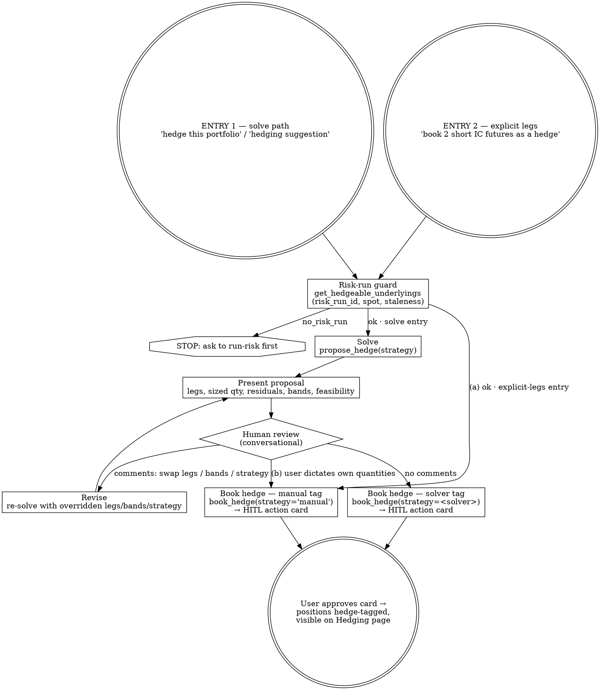

# Hedge Booking via the Agent — Graph-Shaped Workflow + HITL Gate

**Date:** 2026-06-04
**Status:** Approved design, pending implementation
**Branch:** `worktree-hedge-booking-graph`

## Problem

Agent Desk thread 43 ("hedge booking test 1") showed the agent booking a hedge
through `book_position` instead of `book_hedge` — the same port the Hedging
page's **Book Hedge** button uses (`/api/hedging/book` → `hs.book_hedge`).

Observed flow (from `agent_messages`):

1. User (Risk page, portfolio 4): *"hedging suggestion for this portfolio"* →
   `risk_manager` + `snowball-risk-explain` → report recommending ~2 short IC
   futures against Position 110's CSI500 delta.
2. User: *"Book the Short ~2 IC futures contracts"* → orchestrator matched
   "Direct booking of a NEW product from stated terms" → quote-first question.
3. User: *"It's a hedging instrument book request"* → `trader` + `book-position`
   → `build_product` → `book_position` → **Position 113 booked as a plain
   position** — no `source_payload.hedge` tag, no `HEDGE:{run}:{n}`
   source_trade_id, invisible to the Hedging page.

### Root causes (four layered gaps)

| # | Layer | Gap |
|---|-------|-----|
| 1 | Orchestrator routing (`prompts/orchestrator.md`) | No routing line / matrix row for hedge *execution*; only "hedge feasibility → risk_manager". The quote-first booking rule has no hedging carve-out. |
| 2 | Persona catalog (`personas.py`) | `trader` — the persona receiving all booking intents — cannot see `/skills/workflows/hedging/`; only `risk_manager` has it. The user's clarification was un-correctable in-conversation. |
| 3 | Skill scope (`hedge-portfolio/SKILL.md`) | Only the strategy-solver flow is described. No path for "user already decided the leg + quantity — book it *as a hedge*". `book-position/SKILL.md` has no hedge redirect. |
| 4 | HITL gate (`hitl.py`) — latent bug | `book_hedge`/`set_hedge_bands` are commented "persisted / HITL-gated" in `tools/__init__.py:150` but missing from `INTERRUPT_TOOL_NAMES` — `book_hedge` would book with **no confirmation card**, while `book_position` is gated "irreversible". |

## The confirmed workflow graph

One unified workflow: two entry points, one risk-run guard, one human-review
loop, every path exits through a **`book_hedge` HITL action card** (the
agent-side equivalent of the Book Hedge button).



**Confirmed semantics** (user-approved, option A):

- Both entries pass the risk-run guard — `book_hedge` requires `risk_run_id` +
  `spot`, so even the manual path stops on `no_risk_run` and surfaces staleness.
- The `strategy` field in `source_payload.hedge` is provenance — it records
  *who sized the hedge*: a solver strategy name (MILP-sized) or `"manual"`
  (desk-sized).
- Manual tag has **two on-ramps**: (a) explicit legs stated up front (thread
  43's case), and (b) user dictates their own quantities as a review comment on
  a solver proposal. Solver tag only when the solver sized the booked
  quantities.
- The revise loop re-runs `propose_hedge` with overridden `legs`/`bands`/
  `strategy` — user adjusts constraints, solver still sizes.

## Decisions log

| Decision | Choice | Rationale |
|---|---|---|
| Routing owner | **trader books hedges too** (gains the hedging catalog); risk_manager keeps solve-entry | Booking-shaped intents land on trader; it must be able to see hedge-portfolio. |
| Solid-intent behavior | Book as stated, `strategy="manual"`; the missing piece is the **HITL confirmation** to trigger book_hedge | User-confirmed: the suggestion → booking handoff must surface an action card. |
| Skill shape | **One skill owns the whole graph** — rewrite `hedge-portfolio`, no sibling skill | The graph is one workflow; splitting would cut the review→manual edge across skills. 500-token cap honored by moving leg-dict shape into the tool schema and tag conventions into the uncapped reference doc. |
| book_hedge risk level | `irreversible` (parity with `book_position`; stays gated in YOLO) | Booking creates positions; same blast radius as book_position. |
| set_hedge_bands risk level | `write` (auto-approved in YOLO, like `set_portfolio_rule`) | Reversible configuration write. |

## Design

### 1. `backend/app/skills/workflows/hedging/hedge-portfolio/SKILL.md` — full rewrite

Body must stay ≤ 500 tokens (`skill_lint.BODY_MAX_TOKENS`; current body 479).
The leg-dict field enumeration lives in the tool schema (§5), not the skill.

```markdown
---
name: hedge-portfolio
description: Size and book a per-underlying greek hedge — solver-sized (four
  hedging strategies) or desk-stated legs booked with the manual tag. Use when
  a desk wants to neutralize delta/gamma/vega within bands, book explicit hedge
  legs, or act on an in-thread hedging recommendation.
domain: hedging
workflow_type: action
allowed_envelopes:
  - desk_workflow
may_escalate_to:
  - desk_async
required_context:
  - portfolio_id
optional_context:
  - underlying
  - strategy
  - legs
  - bands
write_actions: true
confirmation_required: true
success_criteria:
  - sized legs with residual greeks and feasibility are returned before booking
  - infeasible hard bands are reported with the binding greek, never booked silently
  - booked legs are tagged with risk_run_id and sizing strategy (solver name or manual)
  - hedge legs are never booked through book_position
---

## When to use

- Solve entry: desk wants per-underlying greeks neutralized.
- Manual entry: desk states explicit hedge legs/quantities or acts on an
  in-thread recommendation.

## Procedure

1. Guard (both entries): `get_hedgeable_underlyings(portfolio_id)`. On
   `no_risk_run`, stop — ask to run risk first. Warn if stale. Keep
   `risk_run_id` and `spot` — `book_hedge` needs them.
2. Manual entry — user stated instrument(s) + signed quantities: go to step 6
   with `strategy="manual"` and the stated legs. `underlying` is the hedged
   exposure's symbol, not the hedge instrument's code.
3. Solve entry: pick `underlying` + `strategy` (confirm if unspecified); call
   `propose_hedge(portfolio_id, underlying, strategy)`.
4. Present legs, bands, quantities, residuals. If `infeasible`, report binding
   greek(s) + shortfall; suggest an option leg or wider band. Do not book.
5. Review loop: on comments, re-solve with overridden `legs`/`bands`/`strategy`
   and re-present. If the user dictates quantities, switch to step 6 with
   `strategy="manual"`.
6. Book: `book_hedge(portfolio_id, underlying, risk_run_id, strategy, spot,
   legs)`. The HITL confirmation card is the booking gate.
7. Report booked position ids — hedge-tagged, on the Hedging page.

## Stop conditions

Never book an infeasible hard-band solution, guess greek targets without a
completed risk run, or book hedge legs via `book_position` (loses the hedge
tag).

## Output shape

Feasibility (solve) or stated legs (manual) first; then strategy or `manual`,
per-leg quantities, residual/binding greeks, booked ids.

## References

- `/skills/references/hedging/strategy.md`

## Example

User: Book the short 2 IC futures as the CSI500 hedge.
Assistant: get_hedgeable_underlyings(4) → fresh → book_hedge(4, "000905.SH",
run_id, "manual", spot, [future IC qty −2]) → HITL card → ids.
```

This body is **verified at 499/500 tokens** (`skill_lint.count_body_tokens`).
Headroom is 1 token: any implementation deviation must re-count, trimming
prose from steps 4–5 first — the reference doc absorbs detail, never the
other way around.

### 2. `backend/app/skills/references/hedging/strategy.md` — manual-tag convention

Append (reference docs have no token cap):

```markdown
## Manual tag

- `strategy="manual"` marks desk-sized hedges: the user stated the legs and
  quantities (up front, or by dictating quantities during proposal review).
- Solver strategy names mark MILP-sized hedges. The tag records who sized the
  hedge; both book through `book_hedge` and carry the source risk_run_id.
```

### 3. HITL gate — `backend/app/services/deep_agent/hitl.py`

- `INTERRUPT_TOOL_NAMES` += `"book_hedge"`, `"set_hedge_bands"`.
- `_RISK_LEVEL_BY_TOOL` += `"book_hedge": "irreversible"`,
  `"set_hedge_bands": "write"`.
- `_LABEL_BY_TOOL` += `"book_hedge": "Book hedge"`,
  `"set_hedge_bands": "Set hedge bands"`.

Effect: `book_hedge` pauses the turn and surfaces a Pending-Confirmation action
card (parity with the Book Hedge button); it stays gated in YOLO mode.
`set_hedge_bands` is gated normally, auto-approved in YOLO. This also makes the
"hedging writes (persisted / HITL-gated)" comment at `tools/__init__.py:150`
true.

### 4. Orchestrator routing — `backend/app/services/deep_agent/prompts/orchestrator.md`

- **Routing section** (after the "Risk, VaR…" line): hedge execution routes by
  entry: solve-entry requests ("hedge this portfolio", "neutralize
  delta/gamma") → `risk_manager` with `hedge-portfolio`; explicit hedge-leg
  bookings or acting on an in-thread hedging recommendation → `trader` with
  `hedge-portfolio`.
- **Quote-first booking rule**: add the carve-out — a hedge booking (the user
  calls it a hedge, or the booking acts on a hedging recommendation from this
  thread) is NEVER quote-first and never `book-position`; route to
  `hedge-portfolio`.
- **Known single-persona skills table** (+2 rows):

  | Request shape | Persona | Suggested skill |
  |---|---|---|
  | Solve/size a portfolio greek hedge (strategies, bands) | risk_manager | hedge-portfolio |
  | Book stated hedge legs / act on a hedge recommendation | trader | hedge-portfolio |

- **Persisted/HITL tool list** (single-write-per-turn rule): add `book_hedge`
  and `set_hedge_bands`.

### 5. Persona catalogs + prompts

- `personas.py` `trader_spec`: skills += `"/skills/workflows/hedging/"`
  (inserted after `"/skills/workflows/pricing/"`).
- `prompts/trader.md`: one line — hedge bookings use `hedge-portfolio` /
  `book_hedge`, never `book_position` (the hedge tag and Hedging-page
  visibility depend on it).
- `prompts/risk_manager.md`: one line after the `recommend_hedge` roster entry
  — to *act* on a hedge suggestion, use `hedge-portfolio` (`book_hedge`).

### 6. Adjacent skills

- `book-position/SKILL.md` (body 497/500 — trim ~25 tokens of prose to fit):
  add stop-condition line — "Booking a hedging instrument against book
  exposure → use `hedge-portfolio` (`book_hedge`); booking it here loses the
  hedge tag."
- `snowball-risk-explain/SKILL.md` (body 371/500): add procedure step — if the
  desk wants to act on a hedging suggestion, hand off to `hedge-portfolio`
  (`book_hedge`); never `book-position`. Name `hedge-portfolio` in the
  "recommended next workflow" output line.

### 7. Tool schema + service validation

`backend/app/tools/hedging.py` — `BookHedgeInput` gains Field descriptions:

- `underlying`: hedged exposure's symbol (e.g. `000905.SH`), not the hedge
  instrument's contract code.
- `risk_run_id`, `spot`: from `get_hedgeable_underlyings` (or the proposal).
- `strategy`: `delta_neutral|delta_neutral_enhanced|delta_gamma_neutral|`
  `full_neutral` for solver-sized legs, or `manual` for desk-stated legs.
- `legs`: each leg `{instrument_type: future|spot|option, quantity: signed
  lots, contract_code, exchange, multiplier, expiry (ISO date); options add
  strike, option_type}`.

`backend/app/services/domains/hedging_strategy.py` — `book_hedge` validates
`strategy` ∈ `set(STRATEGIES) | {"manual"}`, raising `ValueError` otherwise
(the tool-error boundary converts it to an error ToolMessage; the UI path only
sends solver names and is unaffected).

## Test impact

| Test | Change |
|---|---|
| `tests/test_hitl.py::test_interrupt_tool_names_covers_all_state_mutating_tools` | exact set += `book_hedge`, `set_hedge_bands` |
| `tests/test_hitl.py::test_yolo_mode_uses_langchain_auto_approval_for_write_tools` | assert `book_hedge` stays gated, `set_hedge_bands` drops out |
| `tests/test_skills_catalog_v2.py::test_persona_sources_are_workflow_only` | trader sources += `/skills/workflows/hedging/` |
| `tests/test_skills_catalog_v2.py::test_trader_total_workflow_catalog` | `len == 20` → `21`; assert `hedge-portfolio` in trader catalog |
| `tests/test_skills_catalog.py` (v1) | verify + update any analogous trader-source pins |
| `tests/test_workflow_skills_phase3.py` | verify no content pins on the rewritten skill break |
| Skill lint (CI) | all edited SKILL.md bodies ≤ 500 tokens |
| New service test | `book_hedge` rejects unknown strategy; accepts `manual` (tag lands in `source_payload.hedge.strategy`) |

No SKILL.md files are added or removed — the catalog exact-set pins on
*per-domain skill names* are unaffected; only persona-source pins change.

## Out of scope (documented)

- Retro-tagging thread 43's Position 113 as a hedge (one-off data fix, not a
  code change).
- Evaluate-mode `propose_hedge` (fixed-quantity residual evaluation) — deferred
  YAGNI; manual bookings book as stated without solver residual math.
- `recommend_hedge` tool changes — the suggestion→booking handoff lives in the
  skill/prompt layer.
- Frontend changes — `strategy` is displayed as a loose `string`
  (`types.ts:886`); `HedgeStrategyName` constrains only solver *requests*.

## Verification

1. `PYTHONPATH=<worktree>/backend python3 -m pytest tests/test_hitl.py
   tests/test_skills_catalog.py tests/test_skills_catalog_v2.py
   tests/test_workflow_skills_phase3.py -q` — green.
2. Skill lint: no errors, all bodies ≤ 500 tokens.
3. New/updated service tests green.
4. Manual replay of thread 43's script against a dev stack: "hedging suggestion
   …" → "Book the Short 2 IC futures" must produce a **Book hedge** action
   card (not a `book_position` card); approving books positions with
   `source_payload.hedge.strategy == "manual"` and the run's `risk_run_id`,
   visible on the Hedging page.
